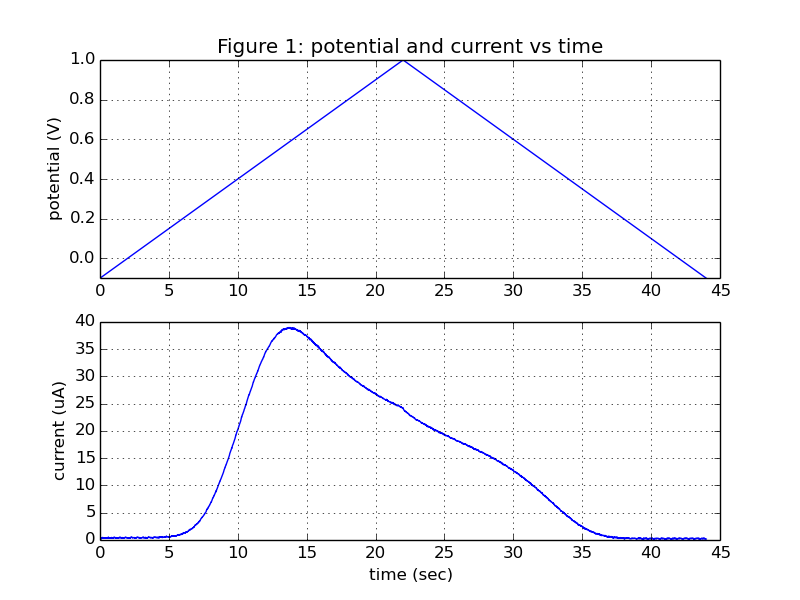
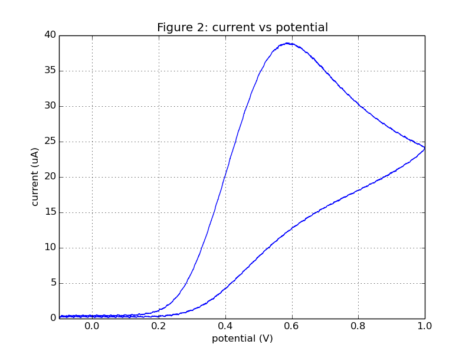
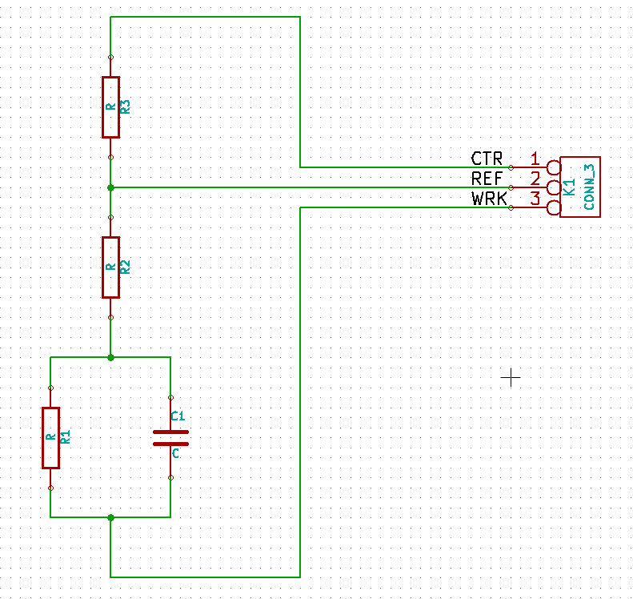
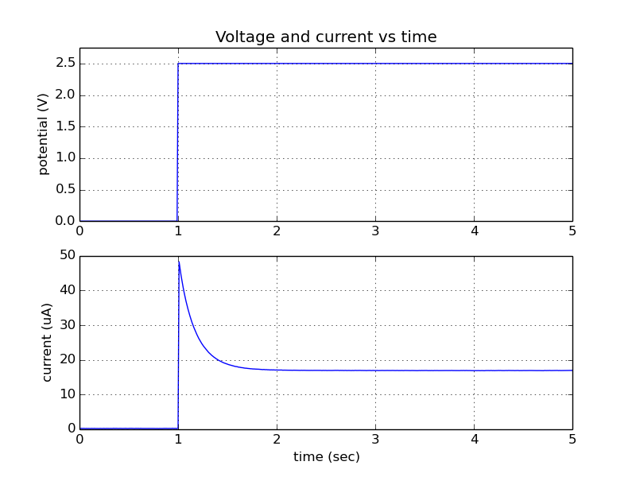
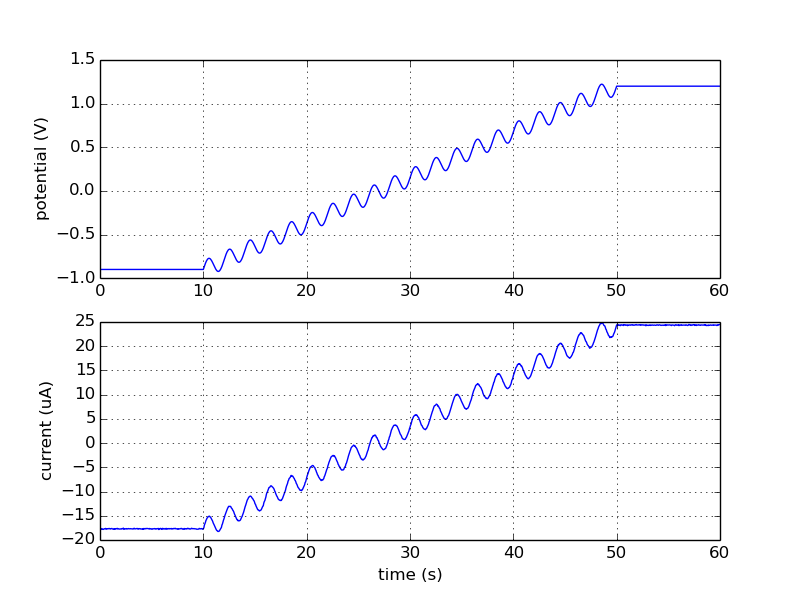

.. _examples_ref:

###############
Worked Examples
###############

In this section we show several worked examples demonstrating how to use iorodeo-potentiostat library
with your Rodeostat shield to make measurements. 

.. note::

   The examples in this section make use of the `Matplotlib`_ plotting library.
   You can find Instructions for installing maplotlib here: `installing Matplotlib`_.

******************
Cyclic voltammetry
******************

In the following example we demonstate how perform a `cyclic voltammetry`_ test with the following parameters:

* Starts and ends at minimum voltage of -100 mV . 
* Reaches a maximum voltage of 1000 mV at mid-cycle.
* Transistions at a rate of 50 mV/s (-50 mV/s) from the minimum (maximum) to the maximum (minimum) voltage.
* Performs a single cycle i.e., transistions from minimum to maximum and back to minimum exactly once.

As the test is run the data are saved to a file named *data.txt*. The data
in the file consist of comma separated values of time, voltage and current.
After the test is complete two figures are created to display the data. The
first figure shows plots of the voltage (potential) and current vs time. The
second figure shows a plot of the current vs the voltage (potential).

.. literalinclude:: ../examples/run_cyclic_w_plot.py
   :language: python 
   
An example of the data generated by running this test using a screen printed
electrode in a 8mM solution of ascorbate, is shown below.

Further details on the methods used for the ascorbate experiments can be found
here `http://potentiostat.iorodeo.com/methods`_.

****************************
Constant voltage voltammetry
****************************

This example demonstrates how to preform constant voltage voltammetry. The test parameters are as follows: 

* Prior to the start of the test a quiet period is used where the output voltage at 0V for 1s (1000ms). 
* During the test the output voltage is set to 2.5V and kept there for 4s (4000ms). 
* Data is acquired at a rate of 100 samples/second for the duration of the quiet period and the constant voltage test.

.. literalinclude:: ../examples/run_constant_w_plot.py
   :language: python 

Consider the dummy cell schematic show below.  We will use this dummy cell to
generate example data using the constant voltage test program (above).

There are three resistors  (R1, R2, R3) and one capacitor (C1) on the dummy
cell. In the example below, showing voltage and current vs time, the values of the resistors and capacitors are:
R1=100k, R2=50k, R3=0 Ohm (wire conductor), C1=4.7 uF. 

During the one the 1 second quiet period the output voltage is 0 V.  After 1
second the actual test begins and the output voltage is set to 2.5 V. There an
initial spike in current at the start of the test. The current then decays
exponentially, as the capacitor C1 charges, gradually approaching a steady state
value.

**********************
Manual/direct control:  
**********************

In this section we give several examples which demostrate how to use the
Rodeostat  in manual/direct control mode. When using this mode,
the output voltage is set and the current is measured directly from the host PC
using the :meth:`~potentiostat.Potentiostat.set_volt` and
:meth:`~potentiostat.Potentiostat.get_curr` methods.  Note, the timing in
manual/direct control mode is determined by the software on the host PC and it
will not be as precise as when using a pre-programmed voltammetric test running
in firmware on the Teensy 3.2.  However, it does offer a great deal of
flexibility to the user and enables the creation of custom voltammetric test
without any firmware programming. 

Example 1: linear plus sinewave
================================

This example demonstrates how to use manual/direct control to create an output voltage 
which is sum of a linear function and a sine wave.  

.. literalinclude:: ../examples/manual_control_v2.py
   :language: python 

Example data generated using the program above for 50k dummy cell (R1=50k,
R2=R3=0 , C1=0) is shown below.  

In a similar manner you can easily create other custom tests by writing your
own custom voltage function which gives specifies the desired output voltage as
a function of time.

Example 2: long duration constant voltage test 
==============================================

Suppose you want to perform a very long duration (hours to days) constant
voltage test with the potentiostat. The sample rate for this test would be
fairly low - seconds to minutes between samples. In addition you wanted it such
that the logging application for this test could be interrupted and re-started
and any time.  

In the example below demonstrate how to use manual/direct control to create a
such a data logger for long duration constant voltage tests.  Once started, the
data logger shown below will run forever or until stopped by the user with
Ctl-C. The tests can be stopped and re-started and any time.  On restart if the
data logger finds an existing log file it will open this file and append data to it,
otherwise a new log file will be created. 

.. literalinclude:: ../examples/const_volt_logger.py
   :language: python 

**********
References
**********

.. target-notes::

.. _`Matplotlib`: http://matplotlib.org/ 
.. _`installing Matplotlib`: http://matplotlib.org/users/installing.html 
.. _`cyclic voltammetry`: https://en.wikipedia.org/wiki/Cyclic_voltammetry
.. _`http://potentiostat.iorodeo.com/methods`: http://potentiostat.iorodeo.com/methods 

