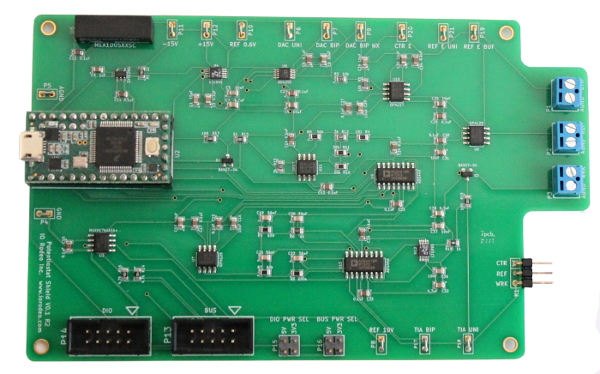

.. iorodeo-potentiostat documentation master file, created by
   sphinx-quickstart on Fri Mar 24 10:38:13 2017.
   You can adapt this file completely to your liking, but it should at least
   contain the root `toctree` directive.

####################
iorodeo-potentiostat  
####################

A Python library for controlling iorodeo's Potentiostat Shield 

IO Rodeo's Potentiostat Shield is an open source potentiostat for performing
electrochemical measurments which is designed to work with the `teensy 3.2
development board <https://www.pjrc.com/teensy/teensy31.html>`_. 

The **iorodeo-potentiostat** library provides a simple highlevel intreface for
controlling the potentiostat shield allowing users to easily:  

* set/get the parameters used for the voltammetric tests
* run voltammetric tests and collect data from the device (time, voltage, current)
* set/get the output voltage and current measurement ranges
* set/get the sample rate/period used for measurements

To quickly get up and running using the library see the Getting Started guide.
For a more comprehensive coverage of the API provided by the library see the
API Reference.

Contents:

.. toctree::
    :maxdepth: 2

    getting_started
    example_cyclic
    test_param
    api_reference
    hardware

******************
Indices and tables
******************

* :ref:`genindex`
* :ref:`modindex`
* :ref:`search`

